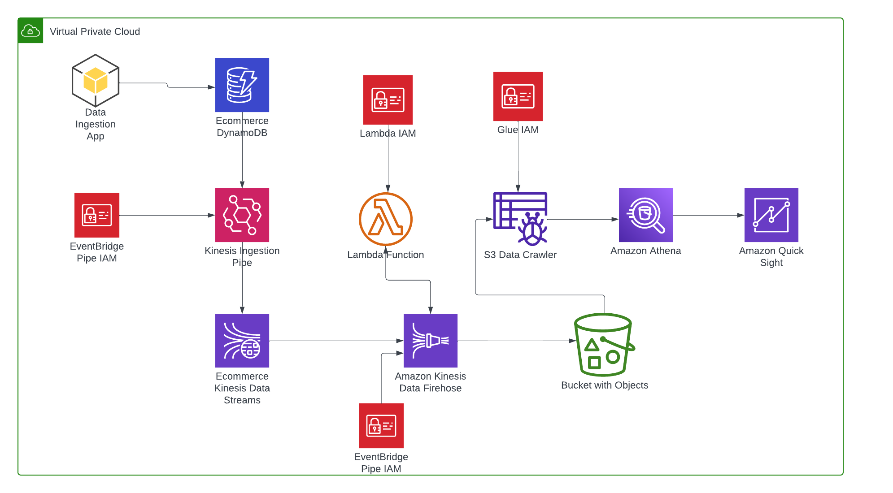

# Ecommerce Real-Time Data Streaming Pipeline

- This project aims to develop the full fledge real-time data pipeline for Ecommerce orders data. Real-time Data received from 
API/python app will be inserted in `DynamoDB` and which is integrated as source with `EventBridge Pipe` and pipe target is `Kinesis Data Stream`. This will also capture CDC to maintain historical data. Kinesis data stream will send data do `Amazon Data Firehose` which will process the real-time messages and ingest them to `s3 bucket`. `AWS Glue Crawler` will crawl this data from s3 bucket and which is then integrated with `AWS Athena` to peform analysis on data and which is further integrated with `Amazon Quciksight` to build interactive dashboards.

# Data Pipeline Architecture

Following AWS services and tools have been used to build this pipeline

- AWS DynamoDB
- AWS Kinesis
- Amazon Data Firehose
- AWS EventBridge
- AWS IAM
- AWS S3
- AWS Lambda
- AWS Glue
- AWS Quicksight

# How to Setup and Run the project

## Setup DynamoDB Table
- Create table `OrdersRawTable` in dynamodb
- Set `Partition key` as `orderid`
- In table, go to `Exports and streams` tab, then go to `DynamoDB stream details` section and choose view `New image` and turn on stream.

## Setup Kinesis Stream
- Create a kinesis stream `kinesis-for-sales-data`

## Setup EventBridge Pipe
- Create an EventBridge pipe `sales-ingestion-dynamodb-to-kinesis`
- Select `dynamodb` as source with starting position as `Latest`
- Select `kinesis stream` as target and select orderid as partition key using this syntax `$.dynamodb.Keys.orderid.S`
- Grant pipe IAM role the following permissions,
    - AmazonDynamoDBFullAccess
    - AmazonKinesisFullAccess

## Product Data in DynamoDB
- You can insert data in dynamodb using `python3 mock_data_generator_for_dynamodb.py` and verify the data in table.
- In kinesis data stream, go to `Data viewer` tab, select the `starting_position = At timestamp` and check records in different shards respectively.
- If you change any record manually or from script in the dynamodb table, CDC (change data capture) will be captured in kinesis data stream which means multiple records with `events -> INSERT, MODIFY` will be in shards.

## Setup Amazon Data Firehose
- Setup an `s3 bucket` where your processed data from data firehose will be stored.

## Setup Amazon Data Firehose
- Create a `kinesis firehose stream` and choose the `kinese stream as source` and `s3 as target` and choose source stream and target s3 bucket respectively.
- Create a lambda function `process-kinesis-firehose` and choose it kinesis firehose `Transform source records with AWS Lambda`.
- Attach the following permissions to the Lambda IAM role,
    - AmazonKinesisFirehoseFullAccess
    - AmazonKinesisFullAccess	
    - AWSLambdaKinesisExecutionRole
- Attach the following permissions to kinesis firehose IAM role,
    - AmazonKinesisFirehoseFullAccess
    - AmazonKinesisFullAccess	
    - AmazonS3FullAccess
    - AWSLambdaKinesisExecutionRole
    - AWSLambda_FullAccess

## Setup AWS Glue Crawler with s3 Data Source
- Create a glue crawler with custom `json classifer` to crawl json ingested data in s3
- Setup the following the format in json classifier `$.orderid,$.product_name,$.quantity,$.price,$.cdc_event_type,$.creation_datetime`

## View Data in AWS Athena and Build Quicksight Dashboard
- Now choose the database in AWS Athena that you selected in glue crawler and view the data stored in table.
- TODO: Integrate this AWS Athena real-time ingested data with Quicksight dashboard.

